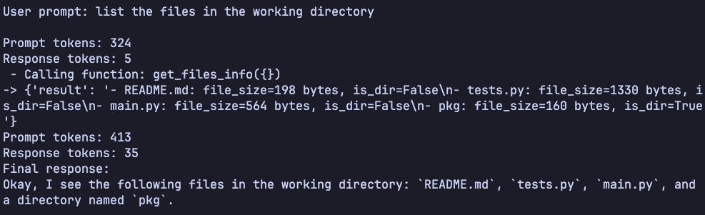

# AI Agent (Python)

A command-line AI coding assistant powered by Gemini, written in Python. This tool allows you to interact with your codebase: list files, read file contents, execute Python scripts, and write files—all from your terminal.



## Features

- List files and directories within a specified working directory.
- Read file contents with automatic truncation for large files.
- Execute Python files with optional arguments and view their output.
- Write or overwrite files securely within the working directory.
- Secure path handling to prevent access outside the working directory.
- Extensible function call system for adding new capabilities.

## Why Did I Build This

This project was created to explore building a practical AI-powered coding assistant that integrates with the Gemini API. It demonstrates secure file operations, function calling, and conversational AI workflows in Python.

## Tech Stack

- [Python 3](https://www.python.org/) for the runtime environment.
- [Google Gemini API](https://ai.google.dev/) for AI-powered content generation and function calling.
- [python-dotenv](https://pypi.org/project/python-dotenv/) for environment variable management.
- [unittest](https://docs.python.org/3/library/unittest.html) for testing.

## Usage

1. **Requires [uv](https://github.com/astral-sh/uv) package manager.**

2. **Create a virtual environment in the top-level directory:**
   ```sh
   uv venv
   ```
3. **Activate the virtual environment:**
   ```sh
   source .venv/bin/activate
   ```
4. **Install dependencies:**
   ```sh
   uv sync
   ```   
5. **Set up your environment:**
   - Copy .env.sample to .env and add your Gemini API key.

6. **Interact with the agent:**
   ```sh
   uv run main.py <Enter your prompt here to interact with the codebase!> [--verbose]
   ```   

## Lessons Learned

Building this AI agent provided experience with secure file handling, integrating LLMs with function calling, and designing robust CLI tools. Handling user input securely and managing conversational state were key challenges.

## Author

Thanks for checking out this project! Feel free to reach out with questions or suggestions.

- Portfolio: [nickabate.dev](https://nickabate.dev/)
- LinkedIn: [Nick Abate](https://www.linkedin.com/in/nick-abate/)